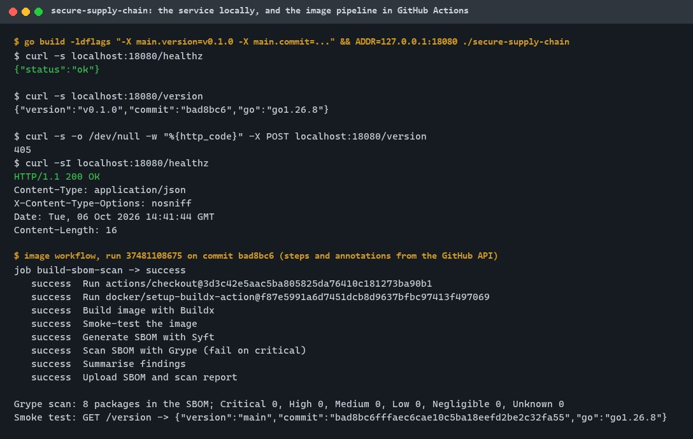
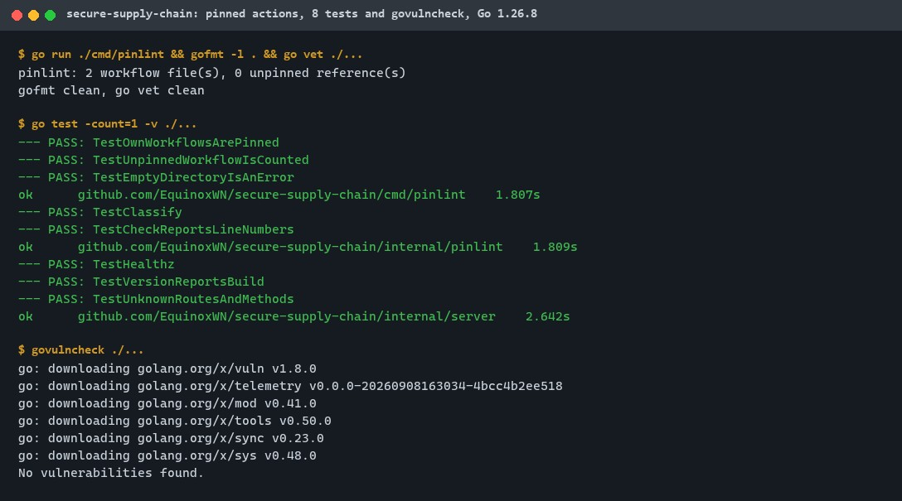
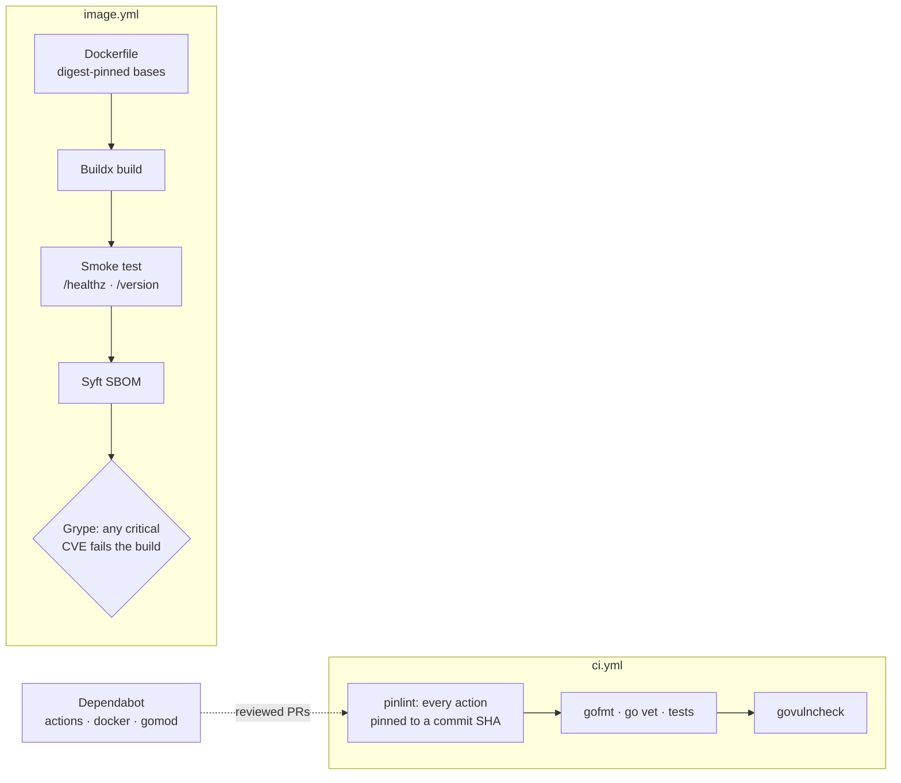
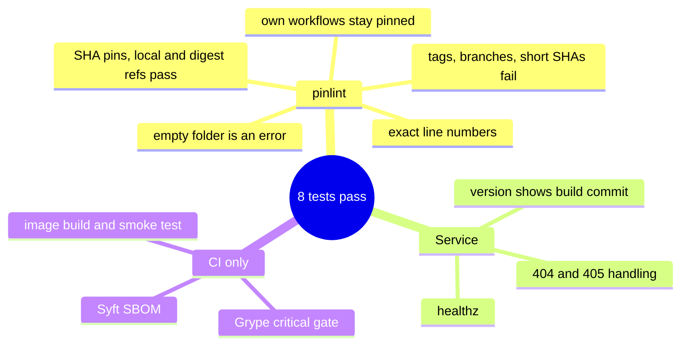

# secure-supply-chain

[](https://github.com/EquinoxWN/secure-supply-chain/actions/workflows/ci.yml)


> Stops a vulnerable image reaching production: actions pinned by commit SHA, and every image smoke-tested, described by an SBOM and scanned, with critical CVEs failing the build.

Part of my **DevOps and Cloud** list · Go · YAML · core project

## Proof it works

The service locally (health check, build information, wrong method refused, `nosniff` header), and the image pipeline in GitHub Actions on the latest commit: the image is built, smoke-tested, described by an SBOM and scanned, with no known vulnerability at any severity. The CI results come from the run's public annotations:



Every action in the workflows is pinned to a full commit SHA, 8 tests pass, and govulncheck finds nothing with Go 1.26.8:



## Architecture

**What M1 runs today:**



**Full roadmap (M1 to M3):**


## How it works

_Steps 1 and 2 are built and tested (M1); the rest is on the [roadmap](#roadmap)._

1. Third-party actions are pinned by commit SHA and the image is built with Buildx.
2. Syft generates an SBOM and Grype scans it; critical CVEs fail the build.
3. cosign signs the image keylessly with the workflow's OIDC identity, and the signature is recorded in the public Rekor transparency log.
4. slsa-github-generator produces SLSA provenance stating which repository, commit and workflow built the image.
5. In the cluster, a Kyverno verifyImages policy admits only images signed by your workflow identity with valid provenance.
6. A demo pushes an unsigned, tampered image and shows the admission webhook rejecting it.

## Tech stack

| Area | In M1 | Planned |
|---|---|---|
| Build | GitHub Actions pinned by SHA (checked by `pinlint`), Docker Buildx, distroless image | - |
| Inspect | Syft SBOM, Grype scan | - |
| Sign / enforce | - | Sigstore cosign keyless, slsa-github-generator, Kyverno verifyImages |

Language: **Go · YAML** (Go standard library only).

| Path | What it is |
|---|---|
| `.github/workflows/image.yml` | Buildx build, smoke test, Syft SBOM, Grype scan that fails on critical CVEs |
| `.github/workflows/ci.yml` | Lint (including `pinlint`) and tests, actions pinned by SHA |
| `.github/dependabot.yml` | Weekly PRs to bump pinned actions, base-image digests and Go modules |
| `cmd/pinlint`, `internal/pinlint` | Fails if any workflow uses an action not pinned to a full commit SHA |
| `cmd/secure-supply-chain`, `internal/server` | The service the pipeline ships: `/healthz`, `/version` |
| `Dockerfile` | Multi-stage, static binary, distroless `nonroot`, base images pinned by digest |

## Run it

Needs Go 1.23 or newer; Docker only for `make image`.

```bash
make lint     # pinlint (every action pinned by SHA), gofmt, go vet
make test     # unit tests with the race detector
make pinlint  # just the pinning check
make image    # build the container locally (Docker Buildx)
```

Run the service without Docker:

```bash
go run ./cmd/secure-supply-chain   # then: curl localhost:8080/version
```

The full pipeline (build, SBOM, vulnerability gate) runs in GitHub Actions on every push and pull request; the SBOM and scan report are attached to each run as the `sbom-and-scan` artifact.

## Tests and results

Latest local run (full detail, including every pinned SHA and digest, in [docs/results/m1.md](docs/results/m1.md)):

| Check | Result |
|---|---|
| Unit tests | 8 passed, 0 failed |
| Unpinned action references (`make pinlint`) | 0 in 2 workflows |
| Workflow syntax (`actionlint` v1.7.7) | no errors |
| Base images | pinned by `sha256` digest |
| Linux static build (Dockerfile flags) | builds, 5.9 MB |

The container steps (Buildx build, smoke test, Syft SBOM, Grype critical-CVE gate) run in GitHub Actions; their results appear in each run's job summary.

### Test map



## Roadmap

**M1** (≈15 h)
- [x] Write `docs/rfc/0001-design.md`: problem, goals, non-goals, chosen design
- [x] Third-party actions are pinned by commit SHA and the image is built with Buildx.
- [x] Syft generates an SBOM and Grype scans it; critical CVEs fail the build.

**M2** (≈20 h)
- [ ] cosign signs the image keylessly with the workflow's OIDC identity, and the signature is recorded in the public Rekor transparency log.
- [ ] slsa-github-generator produces SLSA provenance stating which repository, commit and workflow built the image.

**M3** (≈25 h)
- [ ] In the cluster, a Kyverno verifyImages policy admits only images signed by your workflow identity with valid provenance.
- [ ] A demo pushes an unsigned, tampered image and shows the admission webhook rejecting it.
- [ ] Publish the proof below with real numbers

## Proof

What this repo must show before it counts as done:

- Recording of the blocked deploy, plus a threat model mapping each control to a SLSA supply-chain threat.

| Result | Value |
|---|---|
| M3 proof above | Not measured yet (M3). Current M1 numbers: see [Tests and results](#tests-and-results). |

## Why it matters

- **Interview angle:** 'Secure a CI/CD pipeline end to end'.
- **Upstream I'd like to contribute to:** Sigstore cosign or Kyverno.

## Design docs

- [RFC 0001: design](docs/rfc/0001-design.md)
- [ADR 0001: record architecture decisions](docs/adr/0001-record-architecture-decisions.md)
- [ADR 0002: pin everything by immutable reference; gate only on critical vulnerabilities](docs/adr/0002-pin-by-sha-fail-on-critical.md)

## Scope

This is a learning and portfolio system, not a hosted production service. Everything runs locally.

## Security and contributing

- Every GitHub Action is pinned to a commit SHA; workflows run read-only, without persisted credentials.
- Dependabot proposes dependency and action updates weekly.
- `pinlint`, `go vet`, `gofmt` and `govulncheck` on every push; the image is digest-pinned, scanned by Grype and ships an SBOM.
- Report vulnerabilities privately: see [SECURITY.md](SECURITY.md). To contribute, see [CONTRIBUTING.md](CONTRIBUTING.md).

## License

MIT, see [LICENSE](LICENSE).
