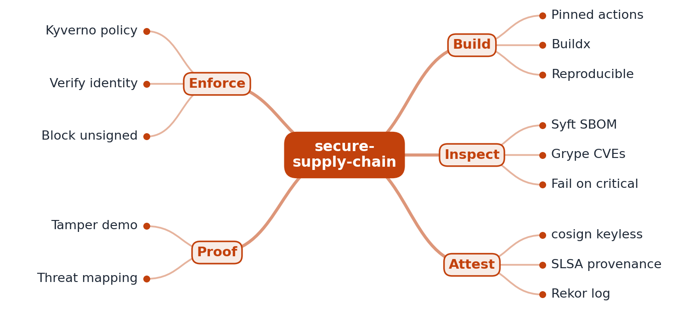

# RFC 0001: secure-supply-chain design

- **Status:** Accepted (M1 implemented)
- **Author:** AUTHOR_NAME
- **Created:** 2026

## Problem

A container image passes through many hands before production: third-party CI actions, base
images, build tools, a registry. Any of them can be tampered with (the tj-actions and Codecov
incidents are real examples), and known-vulnerable packages slip in through base images. Most
pipelines cannot answer "what is in this image, who built it, and has it been changed since?".
This project builds a pipeline where every image is scanned, signed and traceable, and the
cluster refuses anything else.

## Goals

- **M1:** every third-party action pinned to an immutable commit SHA, enforced by a linter;
  images built with Buildx from digest-pinned base images; an SBOM for every image; the build
  fails on any critical vulnerability.
- **M2:** keyless cosign signatures recorded in Rekor; SLSA provenance from
  slsa-github-generator.
- **M3:** a Kyverno `verifyImages` policy that admits only images signed by this workflow, and a
  demo in which a tampered, unsigned image is rejected at admission.

## Non-goals

- Scanning application source code (SAST).
- A production registry or cluster. M3 uses a local kind cluster.
- Running as a hosted production service.

## Proposed design



```
push / PR ─► checkout (pinned SHA) ─► Buildx build ─► smoke test ─► Syft SBOM ─► Grype scan
                                         │                                        │
                               base images pinned by digest            critical CVE => build fails
                                                                                  │
                                            M2: cosign sign + SLSA provenance ◄───┘
                                            M3: Kyverno verifyImages at admission
```

### M1 components

| Component | What it does | Where |
|---|---|---|
| `pinlint` | Fails CI if any `uses:` is not `owner/repo@<40-hex SHA>`, a local action, or a `docker://...@sha256:` digest | `cmd/pinlint`, `internal/pinlint` |
| Service | Minimal HTTP service (`/healthz`, `/version` with the git commit) to give the pipeline a real artifact | `cmd/secure-supply-chain`, `internal/server` |
| Dockerfile | Multi-stage, static binary, distroless `nonroot` runtime, base images pinned by digest | `Dockerfile` |
| Image workflow | Buildx build, smoke test, Syft SBOM (SPDX JSON), Grype scan with `severity-cutoff: critical`, artifacts | `.github/workflows/image.yml` |
| Dependabot | Weekly pull requests that bump pinned action SHAs, base-image digests and Go modules | `.github/dependabot.yml` |

Each pinned action keeps a trailing comment with its release (`# v4.4.0`), so reviewers and
Dependabot can still see and update versions.

## Alternatives considered

| Option | Why not (yet) |
|---|---|
| Pin actions by major tag (`@v4`) | Tags are mutable; a compromised maintainer account can repoint them (the tj-actions incident). |
| Trivy instead of Syft + Grype | Also good. Syft + Grype separates "what is inside" (the SBOM, kept as an artifact) from "is it vulnerable", so the SBOM can be rescanned later without rebuilding. |
| Fail on high as well as critical | Too noisy for a base-image-driven pipeline; critical-only is the stated policy, and high findings are reported in the job summary. See ADR 0002. |
| Alpine runtime image | Has a shell and package manager an attacker could use; distroless `static` has neither and fewer CVEs to triage. |
| Notary v2 instead of cosign | Less tooling around keyless OIDC signing and transparency logs today. |

## Measurement plan

- M1: `pinlint` result for every workflow (unpinned count must be 0); Grype severity counts per
  build in the job summary; the SBOM kept as a build artifact.
- M3: recording of the blocked tampered deploy, plus a threat model mapping each control to a
  SLSA supply-chain threat.

## Milestones

- **M1 (done):** pinned actions with lint, digest-pinned base images, Buildx build, SBOM, critical-CVE gate.
- **M2:** cosign keyless signing and Rekor entry; SLSA provenance.
- **M3:** Kyverno admission policy, tampered-image demo, threat model.

## Risks and open questions

- Pinned SHAs go stale and miss security fixes. Dependabot is the mitigation; the release
  comment makes its pull requests readable.
- A zero-day in a base image passes the gate until the vulnerability database knows it. The kept
  SBOM allows a rescan without rebuilding.
- Docker was deliberately not used on the author's machine, so the image workflow is verified in
  GitHub Actions rather than locally.
